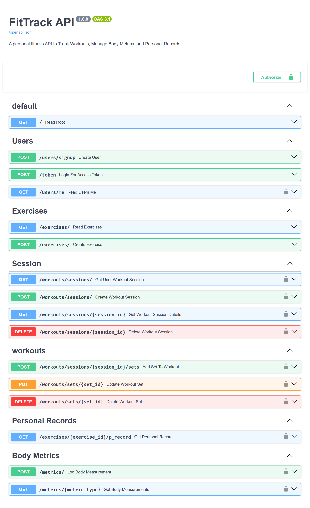

# FitTrack-API

"FitTrack" is a personal fitness RESTful API designed for fitness enthusiasts to track their daily workout sessions, body metrics, and personal best performance records. This project is built with FastAPI and SQLModel, featuring JWT authentication to keep data private and a complete set of CRUD endpoints for managing fitness data. It's nothing but a Gateway to the Fitness World.

## Motivation
I recently started going GYM, I wanted something simple to keep track of my daily workouts, my body weight, my streaks and achievements without any complicated app. Cherry on the top, there was an YSWS called EndPointer going on which pushed me to build a complete RESTful API with JWT authentication from scratch. I'm very happy to successfully build my very first API.


## What it can Do?
I designed the FitTrack API to work like a simple and straightforward digital gym diary. First, you create your own secure account and log in to get started. Once you are in, you can begin a new workout session for the day. As you train, you can add every set you complete by logging the specific exercise, the reps you performed, and the weight you lifted.

But it’s not just about logging data, it's about seeing your progress. You can look back at any past workout to see what you did, and my favorite feature is the Personal Record tracker endpoint, which instantly finds your single best lift for any exercise to help you celebrate your wins. I also added endpoints to track body metrics like weight, so you have a complete picture of your fitness journey over time.



## Tech Stack

* **Backend**: Python 3, FastAPI
* **Database**: SQLite with SQLModel (which uses SQLAlchemy and Pydantic)
* **Server**: Uvicorn
* **Authentication**: JWT 

## Setup and Installation

Follow these steps to get one for yourself -->

1.  **Clone the repository:**
    ```bash
    git clone https://github.com/KeshKunal/fittrack_api
    cd fittrack_api
    ```

2.  **Create and activate a virtual environment:**
    ```
    bash
    # For Windows
    python -m venv venv
    venv\Scripts\activate

    # For macOS/Linux
    python3 -m venv venv
    source venv/bin/activate
    ```

3.  **Install the dependencies:**
    First, you need to create a `requirements.txt` file. Run this command in your terminal:
    ```bash
    pip freeze > requirements.txt
    ```
    Then, anyone using your project can install the dependencies:
    ```bash
    pip install -r requirements.txt
    ```

4.  **Run the application:**
    ```bash
    uvicorn main:app --reload
    ```
    The API will be available at `http://127.0.0.1:8000`.

##  API Documentation

The interactive API documentation will be available at `http://127.0.0.1:8000/docs` after running the application.

### Key Endpoints

| Method | Path                                   | Description                                  |
| :----- | :------------------------------------- | :------------------------------------------- |
| `POST` | `/users/signup`                        | Register a new user.                         |
| `POST` | `/token`                               | Exchange username and password for a JWT access token.            |
| `GET`  | `/users/me`                            | Fetch details for the current active user.      |
| `GET`  | `/exercises/`                            | Gets list of all the exercises available.   |
| `POST` | `/exercises/`                  | Adds details of new Excercise.         |
| `GET` | `/workouts/sessions/`                  | Get list of all workout sessions created by the active user.         |
| `POST` | `/workouts/sessions/`                  | Creates a new, empty workout session for the active user.         |
| `GET` | `/workouts/sessions/{session_id}`                  | Gets list of one specific session with sets performed created by the active user.         |
| `DELETE` | `/workouts/sessions/{session_id}`                  | Deletes a specific workout session and all performed sets.    |
| `POST` | `/workouts/sessions/{session_id}/sets` | Add a new exercise set to a workout session.    |
| `PUT`  | `/workouts/sets/{set_id}`              | Update the details like reps or weight for a specific existing set.|
| `DELETE`| `/workouts/sets/{set_id}`             | Delete a specific exercise set.                       |
| `GET`  | `/exercises/{exercise_id}/pr`          | Returns best performance for a specific exercise.    |
| `POST` | `/metrics/`                            | Allows active user to add body measurements for present date.   |
| `GET` | `/metrics/{metric_type}`                            | Feteches past data for a specific type of measurement like weight.   |


## YSWS Requirements

* **GET**: 3 (Done -6)
* **POST**: 3 (Done - 6)
* **PUT**: 1 Done
* **DELETE**: 1 (Done - 2)
* **JWT Auth**: Done
* **Database**: Done
* **Documentation**: Done
* **8 Hours Requirement**: Done
